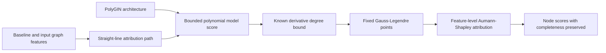

# APEX

[](https://arxiv.org/abs/2607.21094)
[](LICENSE)

Research code for **A Polynomial Architecture-Attribution Co-Design Framework for Exact Aumann-Shapley Attribution in GNNs**.

APEX co-designs a polynomial GNN architecture, **PolyGIN**, with its attribution method. Because the model score remains a bounded-degree polynomial along the baseline-to-input path, APEX can replace heuristic path sampling with a fixed Gauss-Legendre rule that is exact under the paper's stated assumptions, up to floating-point precision.

**Paper:** Bizu Feng, Zhimu Yang, Shuming Wang, Shaode Yu, Yuan Cheng, Xiaojun Qian, and Zixin Hu. [arXiv:2607.21094](https://arxiv.org/abs/2607.21094) · [PDF](https://arxiv.org/pdf/2607.21094)

## Method at a glance



For baseline `x'` and input `x`, APEX evaluates the Aumann-Shapley path attribution

$$\mathrm{AS}_i(x;x')=(x_i-x'_i)\int_0^1
\frac{\partial F\left(x'+\alpha(x-x')\right)}{\partial x_i}\,d\alpha.$$

With `L` polynomial transformation blocks, the derivative along the path has degree at most `2^L - 1`. A `2^(L-1)`-point Gauss-Legendre rule therefore integrates it exactly under the polynomial architecture assumptions. Feature attributions are then aggregated into signed node-level scores while preserving completeness.

## Code map

| Paper component | Implementation |
|---|---|
| PolyGIN architecture | `src/apex/models/gnn.py` |
| Main PolyGINExplainer | `src/apex/explainers/poly_gin.py` |
| Algebraic/exact variant | `src/apex/explainers/algebraic_poly_gin.py` |
| Numerical integration baselines | `src/apex/explainers/*_ig.py` |
| Fidelity, stability, and NFE | `src/apex/evaluation/` |
| Main evaluation | `scripts/evaluate.py` |
| Signed attribution figures | `scripts/visualize_signed_attribution.py` |

FSX is a separate message-flow and structural explanation method maintained in the [FSX repository](https://github.com/Muyuzhierchengse/FSX).

## Repository layout

```text
src/apex/                installable APEX package
scripts/                 training, evaluation, and visualization entries
experiments/variants/    traceable APEX method variants
experiments/legacy/      preserved historical experiments
tests/                   static and lightweight CPU regression tests
data/                    dataset root (runtime, ignored)
artifacts/checkpoints/   model and explainer checkpoints
outputs/                 logs, results, and figures (runtime, ignored)
```

The Aumann-Shapley candidate, Expected IG, PolyGNN Shapley prototype, and marginal-OOD evaluation remain separate under `experiments/variants/`; they are not presented as one merged final algorithm.

## Installation

The lightweight CPU tests use Python 3.9, PyTorch 2.5.1 CPU, torch-geometric 2.6.1, torch-scatter 2.1.2, torch-sparse 0.6.18, NumPy 1.26.4, and SciPy 1.11.4. Full experiments additionally require the research dependencies in `requirements.txt`.

On Windows CPU, install PyTorch and matching PyG binary wheels before the remaining requirements:

```powershell
python.exe -I -m pip install --no-cache-dir --index-url https://download.pytorch.org/whl/cpu torch==2.5.1
python.exe -I -m pip install --no-cache-dir --only-binary=:all: --no-index --find-links https://data.pyg.org/whl/torch-2.5.1+cpu.html torch-scatter==2.1.2+pt25cpu torch-sparse==0.6.18+pt25cpu
python.exe -I -m pip install --no-cache-dir torch-geometric==2.6.1 numpy==1.26.4 scipy==1.11.4
python.exe -I -m pip install --no-cache-dir -r requirements.txt
python.exe -I -m pip install --no-deps --no-cache-dir --no-build-isolation -e .
```

Do not fall back to compiling the PyG extensions from source on this setup.

For a non-editable installation, point the package to this checkout:

```powershell
$env:APEX_PROJECT_ROOT = "E:\workplace\APEX"
```

`APEX_PROJECT_ROOT` must contain `pyproject.toml` and `src/apex`. Project paths are independent of the shell working directory:

- data: `data/`
- checkpoints: `artifacts/checkpoints/`
- logs: `outputs/logs/`
- results: `outputs/results/`
- figures: `outputs/figures/`

## Quick start

The active loader supports `BA_shapes` for node classification and `BBBP`, `Graph-SST2`, `BACE`, and `Mutagenicity` for graph classification. Models include `GCN`, `GCN_2l`, `GIN`, `GIN_2l`, and `PolyGIN`.

```powershell
python.exe scripts/train.py --dataset BBBP --model_used PolyGIN
python.exe scripts/evaluate.py --dataset BBBP --model_used PolyGIN --explainer PolyGINExplainer
python.exe scripts/evaluate_nfe.py --dataset BBBP --model_used PolyGIN --explainer PolyGINExplainer
python.exe scripts/evaluate_fidelity_only.py --dataset BBBP --model_used PolyGIN --explainer PolyGINExplainer
python.exe scripts/compare_exact_fidelity.py --dataset BBBP --model_used PolyGIN
python.exe scripts/visualize_method_comparison.py
python.exe scripts/visualize_signed_attribution.py --device cpu
```

Formal entries may download datasets, train models or PGExplainer, and write artifacts. The refactor validation did not run paper-scale experiments.

## Tests

The lightweight suite uses tiny, fixed-seed artificial graphs and does not train models, download datasets, or load checkpoints.

```powershell
python.exe -I -B -m pytest -p no:cacheprovider -m "not lightweight_graph" --timeout=20 tests
python.exe -I -B -m pytest -p no:cacheprovider -m lightweight_graph --timeout=20 tests
```

## Notes

- This repository contains no APEX dataset or checkpoint.
- The complete DIG, Captum, RDKit, and OGB stack and paper-scale runs were not exercised during the refactor.
- `experiments/legacy/train_imbalanced.py` retains historical Graph-Twitter and `*_3l` contracts; it is not an active entry.
- Only load trusted pickle checkpoints with `torch.load`.

## Citation

```bibtex
@misc{feng2026apex,
  title         = {A Polynomial Architecture-Attribution Co-Design Framework for Exact Aumann-Shapley Attribution in GNNs},
  author        = {Feng, Bizu and Yang, Zhimu and Wang, Shuming and Yu, Shaode and Cheng, Yuan and Qian, Xiaojun and Hu, Zixin},
  year          = {2026},
  eprint        = {2607.21094},
  archivePrefix = {arXiv},
  primaryClass  = {cs.LG},
  doi           = {10.48550/arXiv.2607.21094},
  url           = {https://arxiv.org/abs/2607.21094}
}
```

## License

Released under the [MIT License](LICENSE).
