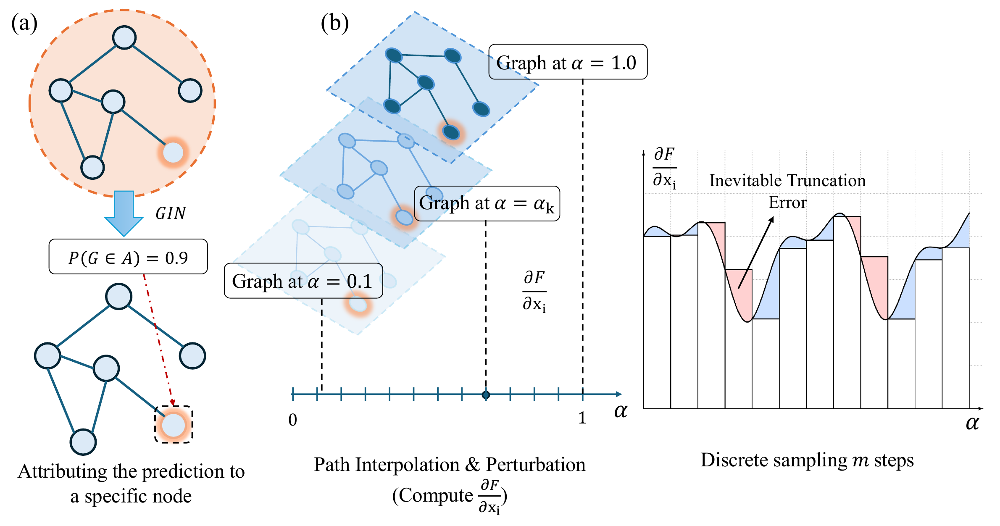
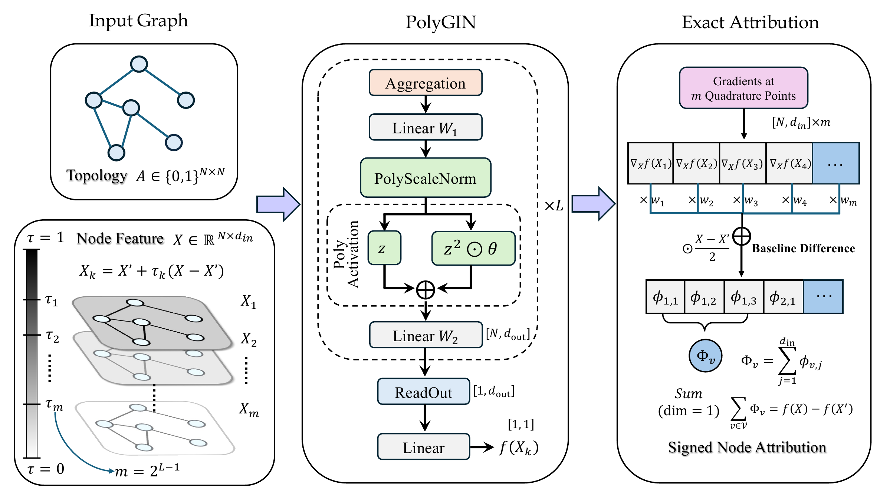

<div align="center">

# APEX

## Exact Aumann–Shapley Attribution through Polynomial Architecture–Attribution Co-Design

[](https://arxiv.org/abs/2607.21094)
[](https://arxiv.org/pdf/2607.21094)
[](LICENSE)

**PolyGIN makes the prediction path polynomial; APEX then computes its attribution exactly under the paper's assumptions.**

</div>

> [!IMPORTANT]
> **Development status — Initial release.** This repository currently contains the first public version of the APEX implementation. The codebase will continue to receive validation updates, documentation improvements, and implementation optimizations.

## Motivation

<p align="center">
  
</p>

<p align="center"><sub>Figure 1 from the paper. Conventional path attribution samples gradients at finitely many points, creating a trade-off between truncation error and computation.</sub></p>

APEX addresses this limitation by designing the predictive architecture and attribution procedure together. Instead of choosing an empirical sampling resolution for an arbitrary nonlinear GNN, it exposes a polynomial degree bound that determines a sufficient finite quadrature budget.

## Method overview

<p align="center">
  
</p>

<p align="center"><sub>APEX computation workflow from the paper: input path, PolyGIN polynomial architecture, and exact signed node attribution.</sub></p>

## How APEX works

The workflow has three linked stages:

1. **Polynomial model.** `PolyGIN` keeps the score along `x(alpha) = x' + alpha (x - x')` polynomial.
2. **Known degree.** With `L` polynomial blocks, the path derivative has degree at most `2^L - 1`.
3. **Exact quadrature.** A fixed `2^(L-1)`-point Gauss–Legendre rule integrates that derivative exactly under the stated architecture assumptions, up to floating-point precision.

The resulting feature attributions are aggregated into signed node scores while preserving completeness.

## Quick start

The active loader supports node classification on `BA_shapes` and graph classification on `BBBP`, `Graph-SST2`, `BACE`, and `Mutagenicity`. Available models are `GCN`, `GCN_2l`, `GIN`, `GIN_2l`, and `PolyGIN`.

```powershell
python.exe scripts/train.py --dataset BBBP --model_used PolyGIN
python.exe scripts/evaluate.py --dataset BBBP --model_used PolyGIN --explainer PolyGINExplainer
```

These research commands may download data, train models, or write outputs. The repository tests do none of those things.

<details>
<summary><strong>Installation</strong></summary>

The lightweight CPU test environment uses Python 3.9, PyTorch 2.5.1 CPU, torch-geometric 2.6.1, torch-scatter 2.1.2, torch-sparse 0.6.18, NumPy 1.26.4, and SciPy 1.11.4. Full experiments additionally require `requirements.txt`.

On Windows CPU, install PyTorch and matching PyG wheels first:

```powershell
python.exe -I -m pip install --no-cache-dir --index-url https://download.pytorch.org/whl/cpu torch==2.5.1
python.exe -I -m pip install --no-cache-dir --only-binary=:all: --no-index --find-links https://data.pyg.org/whl/torch-2.5.1+cpu.html torch-scatter==2.1.2+pt25cpu torch-sparse==0.6.18+pt25cpu
python.exe -I -m pip install --no-cache-dir torch-geometric==2.6.1 numpy==1.26.4 scipy==1.11.4
python.exe -I -m pip install --no-cache-dir -r requirements.txt
python.exe -I -m pip install --no-deps --no-cache-dir --no-build-isolation -e .
```

For a non-editable installation, identify the checkout explicitly:

```powershell
$env:APEX_PROJECT_ROOT = "E:\workplace\APEX"
```

The root must contain `pyproject.toml` and `src/apex`. Runtime paths are resolved from it, never from the shell working directory.

</details>

## Implementation

- `src/apex/models/gnn.py` — `PolyGIN` and the shared GNN models
- `src/apex/explainers/poly_gin.py` — main `PolyGINExplainer`
- `src/apex/explainers/algebraic_poly_gin.py` — algebraic/exact variant
- `src/apex/explainers/` — numerical integration baselines
- `src/apex/evaluation/` — fidelity, stability, and NFE
- `experiments/variants/` — traceable method variants kept separate from the main implementation

```text
src/apex/                installable package
scripts/                 training, evaluation, and visualization
experiments/variants/    method variants
experiments/legacy/      historical experiments
tests/                   static and lightweight CPU regression tests
data/                    runtime datasets (ignored)
artifacts/checkpoints/   runtime checkpoints
outputs/                 logs, results, and figures (ignored)
```

### Entry points

- Main evaluation: `scripts/evaluate.py`
- NFE evaluation: `scripts/evaluate_nfe.py`
- Fidelity-only evaluation: `scripts/evaluate_fidelity_only.py`
- Exact-fidelity comparison: `scripts/compare_exact_fidelity.py`
- Training: `scripts/train.py`
- Method comparison figures: `scripts/visualize_method_comparison.py`
- Signed attribution figures: `scripts/visualize_signed_attribution.py`

## Lightweight validation

```powershell
python.exe -I -B -m pytest -p no:cacheprovider -m "not lightweight_graph" --timeout=20 tests
python.exe -I -B -m pytest -p no:cacheprovider -m lightweight_graph --timeout=20 tests
```

The suite uses tiny fixed-seed graphs. It does not train models, download datasets, load checkpoints, or use CUDA.

> [!NOTE]
> The complete research dependency stack and paper-scale experiments have not been reproduced as part of the repository refactor. Only load trusted pickle checkpoints with `torch.load`.

<details>
<summary><strong>Citation</strong></summary>

```bibtex
@misc{feng2026apex,
  title         = {A Polynomial Architecture-Attribution Co-Design Framework for Exact Aumann-Shapley Attribution in GNNs},
  author        = {Feng, Bizu and Yang, Zhimu and Wang, Shuming and Yu, Shaode and Cheng, Yuan and Qian, Xiaojun and Hu, Zixin},
  year          = {2026},
  eprint        = {2607.21094},
  archivePrefix = {arXiv},
  primaryClass  = {cs.LG},
  doi           = {10.48550/arXiv.2607.21094},
  url           = {https://arxiv.org/abs/2607.21094}
}
```

</details>

Released under the [MIT License](LICENSE).
